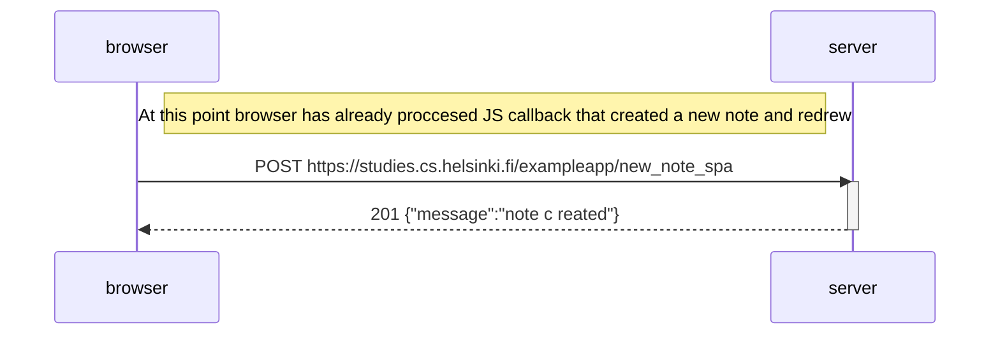

```mermaid
sequenceDiagram
    participant browser
    participant server

Note right of browser: At this point browser has already proccesed JS callback that created a new note and redrew
    browser->>server: POST https://studies.cs.helsinki.fi/exampleapp/new_note_spa
    activate server
    server-->>browser: 201 {"message":"note c reated"}
    deactivate server
```
